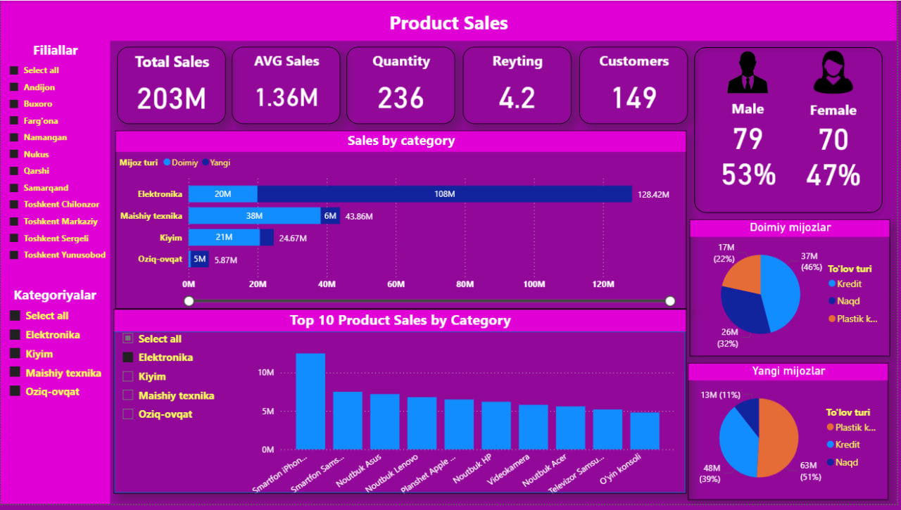

# Product Sales Dashboard

This Power BI project presents a dynamic **Product Sales Dashboard** designed for analyzing sales performance, customer types, and product categories across various regions. The data is sourced from a public dataset and was processed and visualized using advanced **DAX formulas** and **interactive slicers**.

## 📊 Key Features:
- Total Sales, Average Sales, Customer Ratings & Gender Distribution
- Sales analysis by:
  - Product Category
  - Customer Type (New vs Returning)
  - Payment Methods (Cash, Credit, Plastic Card)
- Top 10 product sales visualized by category
- Regional breakdown by dealership locations

## 🧠 Skills Applied & Gained:
- Mastered complex **DAX formulas** for dynamic metrics
- Designed interactive filters and slicers for user-driven analysis
- Improved data storytelling for business decision-making

## 🎯 Use Case:
This dashboard helps **business stakeholders** better understand:
- Which product categories drive the most revenue
- How customer behavior varies by type and payment preference
- Where to focus marketing or inventory strategies

## 📁 Tools Used:
- **Power BI**
- **DAX**
- **Open Source Dataset (CSV/Excel)**

- ## 📸 Preview

Feel free to explore the report visuals or use the PBIX file to test and customize your own analytics!

---
